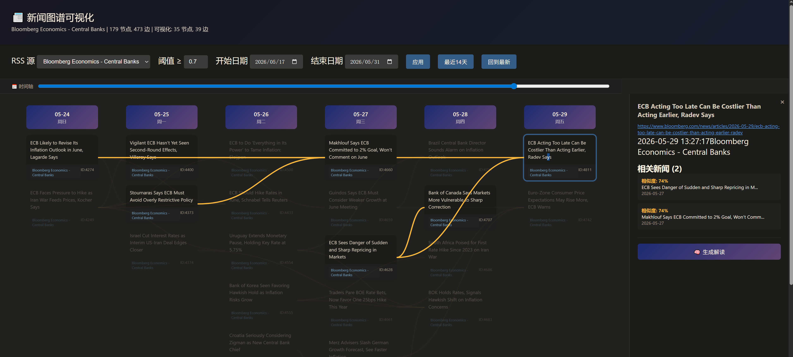

# News Graph - 新闻图谱项目

基于语义相似度的新闻图谱可视化项目。

## 前端效果图



## 当前进度 (2026-05-01)

### ✅ 已完成

1. **数据库设计**
   - `schema.sql` - 图数据库表结构
   - `src/storage/db_storage.py` - 数据库存储模块

2. **Embedding 模块**
   - `src/embedding/encoder.py` - 使用 Sentence-Transformers 生成向量

3. **图构建模块**
   - `src/graph/builder.py` - 基于时间窗口构建边
   - 支持配置：window_days, threshold, max_edges_per_node

4. **API 服务**
   - `scripts/api_server.py` - REST API (端口 8082)
   - 端点：`/api/stats`, `/api/nodes`, `/api/edges`, `/api/graph`, `/api/node?id=`

5. **可视化页面**
   - `data/output/visualize.html` - 时间轴视图
   - 纵向时间轴，同一天新闻横向排列
   - 点击节点查看相关新闻

6. **构建脚本**
   - `scripts/rebuild_db.py` - 重建图数据库
   - `scripts/build_graph.py` - 原始构建
   - `scripts/build_graph_incr.py` - 增量构建（支持 CLI 参数）

### ✅ 已修复：边构建失败

**根本原因（已定位并修复）：**

1. **时区不一致导致 `compute_days_diff` 计算错误**
   - RSS 源中混合了无时区格式 (`2026-02-05 21:17:26`) 和 RFC 2822 格式 (`Fri, 01 May 2026 00:09:46 -0700`)
   - `parse_datetime` 返回混合了 naive 和 aware 的 datetime 对象
   - `compute_days_diff` 中 `replace(tzinfo=None)` 未做时区转换，导致天数差计算完全错误
   - **修复**：`src/utils/db.py` 中 `parse_datetime` 统一将所有日期转为 UTC naive

2. **`np.float32` 被 SQLite 存储为 BLOB**
   - `SentenceTransformer.encode()` 返回 `float32` 数组
   - `compute_cosine_similarity` 的除法结果也是 `np.float32`
   - SQLite Python 适配器将 `np.float32` 绑定为 BLOB 而非 REAL
   - 导致边表 weight 字段全是 bytes，JSON 导出失败
   - **修复**：`src/graph/builder.py` 中 `compute_cosine_similarity` 返回 `float(...)`

3. **`build_edges` 未按时间升序处理数据**
   - `load_entries` 按 `DESC` 返回，而 `build_edges` 的 `for j in range(i+1, n)` 逻辑依赖升序
   - **修复**：`build_graph_incr.py` 在调用 `build_edges` 前显式按时间升序排列

**修复后结果：**
- 节点：773 个
- 边：1911 条（threshold=0.4, window_days=3, max_edges=3）
- weight 类型：REAL ✓
- `in_graph`：全部标记为 1 ✓

### 📁 文件结构

```
news-graph/
├── README.md                    # 本文件
├── schema.sql                   # 数据库结构
├── requirements.txt            # Python 依赖
├── config/config.yaml          # 配置
├── data/
│   ├── news_graph.db         # 图数据库 (SQLite)
│   ├── embeddings/          # embedding 缓存
│   └── output/
│       ├── visualize.html  # 前端可视化页面
│       └── graph_api.json # API 导出数据
├── src/
│   ├── embedding/encoder.py    # Sentence-Transformers 编码器
│   ├── graph/builder.py        # 图构建核心 (cosine similarity + 时间窗口)
│   ├── storage/db_storage.py   # 数据库操作封装
│   └── utils/db.py             # RSS 数据库工具
└── scripts/
    ├── api_server.py           # REST API 服务 (端口 8082)
    ├── build_graph_incr.py     # 主构建脚本 (增量/全量/跳过 embeddings)
    ├── diagnose.py             # 诊断分析脚本
    └── archive/                # 归档的旧脚本
        ├── rebuild_db.py
        ├── build_graph.py
        └── fix_edges.py
```

### 🚀 运行命令

```bash
cd ~/news-graph

# 增量构建（只处理新 RSS 条目）
python3 scripts/build_graph_incr.py --threshold 0.4 --window-days 3

# 全量重建（重新生成所有 embeddings + 重建边，约 7 分钟）
python3 scripts/build_graph_incr.py --rebuild --threshold 0.4 --window-days 3

# 只重建边（复用已有 embeddings，秒级完成）
python3 scripts/build_graph_incr.py --rebuild --skip-embeddings --threshold 0.4 --window-days 3

# 启动 API 服务（后台运行）
nohup python3 scripts/api_server.py > /tmp/api_server.log 2>&1 &

# 检查服务状态
curl -s http://localhost:8082/api/feeds | head -c 50

# 停止服务
kill $(lsof -t -i:8082)

# 重启服务（先停后启）
kill $(lsof -t -i:8082) 2>/dev/null; sleep 1; nohup python3 scripts/api_server.py > /tmp/api_server.log 2>&1 &

# 访问可视化
# http://localhost:8082/visualize.html
```

### 📊 RSS 数据库信息

来源：`~/services/rsstt/config/db.sqlite3`

- entries: 632+ 条
- feeds: 8 个 (Bloomberg, Reuters)
- 时间范围: 2026-02 ~ 2026-05